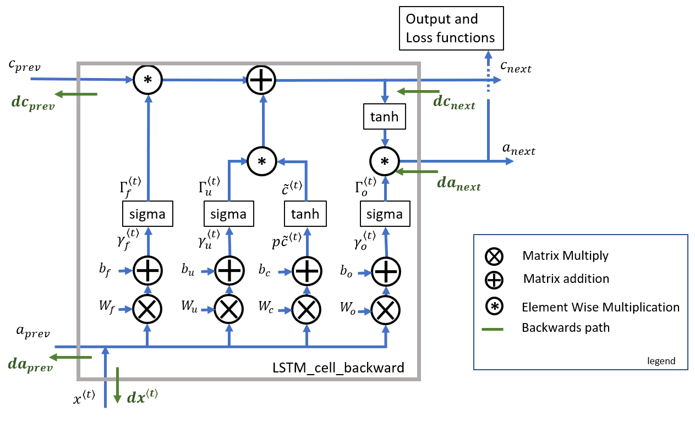

# Recurrent Neural Network with NumPy.

This repository is the implementation of a Recurrent Neural Network (RNN) in NumPy.

Recurrent Neural Networks (RNN) are very effective for Natural Language Processing and other sequence tasks because they have "memory." They can read inputs $x^{\langle t \rangle}$ (such as words) one at a time, and remember some contextual information through the hidden layer activations that get passed from one time step to the next. This allows a unidirectional (one-way) RNN to take information from the past to process later inputs. A bidirectional (two-way) RNN can take context from both the past and the future.

## Forward Propagation for the Basic Recurrent Neural Network

$N.B$ : In the following example the number of inputs is equal to the number of outputs ( $T_x = T_y$.)

<center>

</center>

### 1. RNN Cell
First, we'll implement the computations for a single time step. The following figure describes the operations for a single time step of an RNN cell:

<center>

</center>

### 2. RNN Forward Pass
A recurrent neural network (RNN) is a repetition of the RNN cell that was just built. 

<center>

</center> 

## Backward Propagation for the Basic Recurrent Neural Network

Computing backward pass for the basic RNN cell:

<center>
 
</center>

## Long Short-Term Memory (LSTM) Network
The following figure shows the operations of an LSTM cell:

<center>

</center>

## Forward Pass for  LSTM
Implementing Forward Propagation for LSTM cells:

<center>

</center>

## Backward Pass for LSTM
Computing backward pass for the LSTM cell:

<center>

</center>

## Setup
1. Clone this repository

```shell
git clone https://github.com/abel-shimeles/Recurrent_Neural_Network_From_Scratch.git
cd Recurrent_Neural_Network_From_Scratch
```

2. Using the [rnn.py](rnn.py) file build your own Recurrent Neual Network from model scratch.
